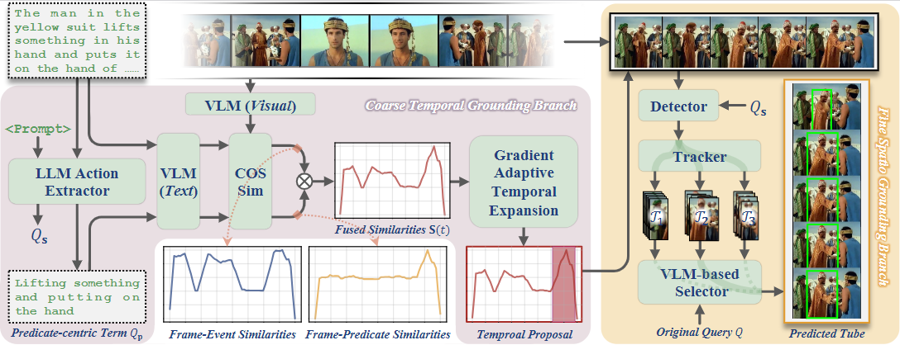

# Rethinking Training-Free Spatio-Temporal Video Grounding: Decoupled Modeling Framework for Efficiency

  

**Figure:** Training free pipeline of DeMo.
For an untrimmed video $V$ and a user-specific query $Q$,
DeMo first extract visual-text similarities based on predicate-center term $Q_{\textbf{p}}$ and original query $Q$ .
Then the gradient adaptive temporal expansion method  is employed to generate the time segment of the event.
Finally, the spatial grounding module accurately predict the object tube from the segmented video clip.
